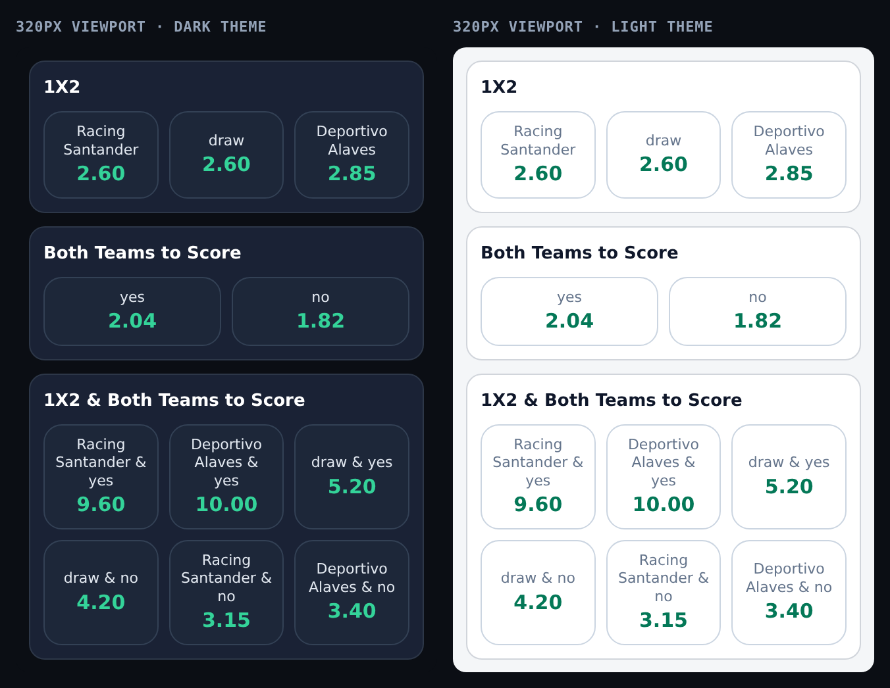
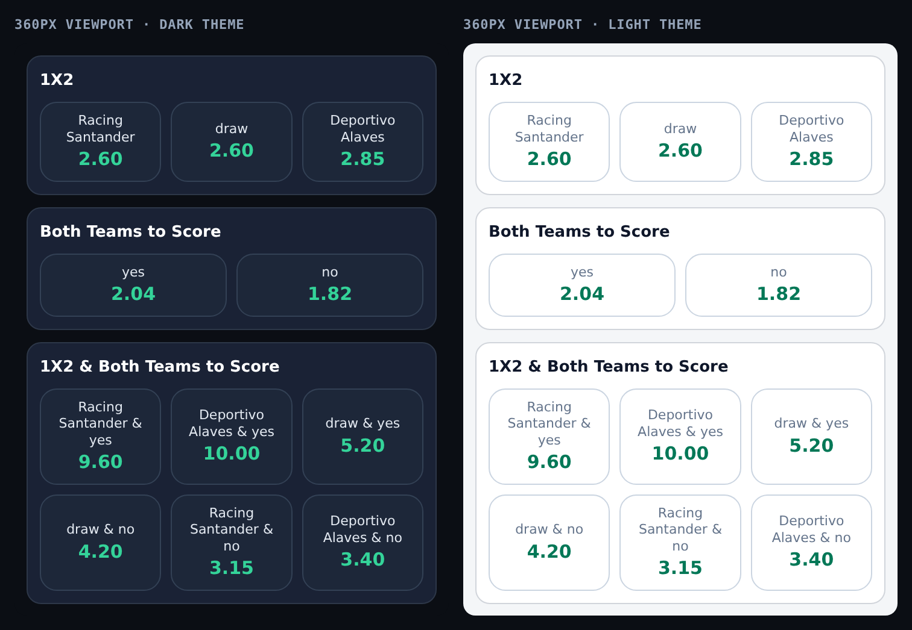
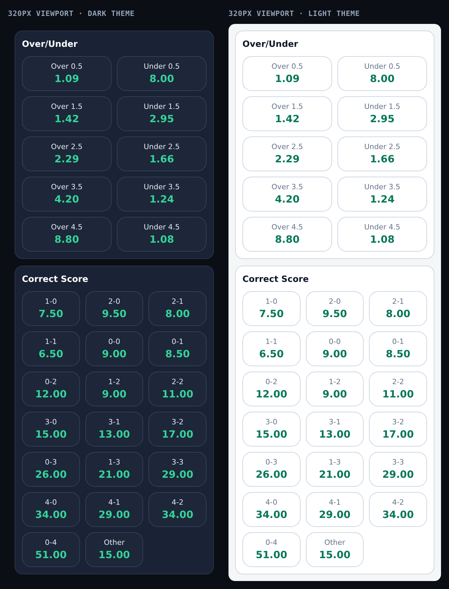
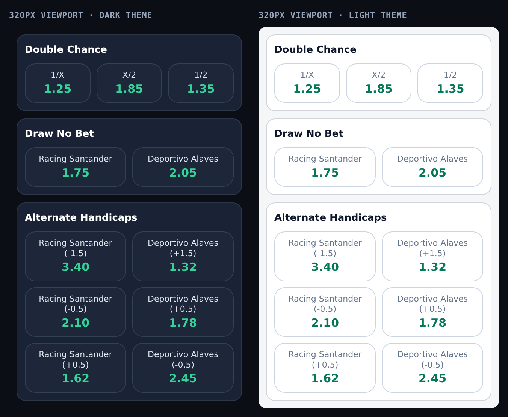
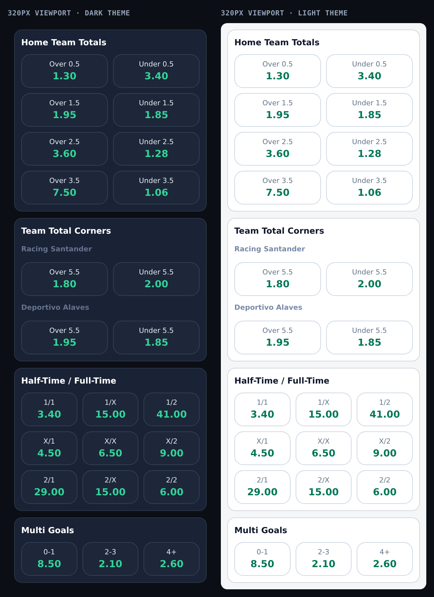

# Odds widget — market layout reference

Reference renders of every layout the bookable odds cell produces, captured at
**320px and 360px** viewports in **both themes**. Each image shows the dark
theme on the left and the light theme on the right, rendered from the compiled
CSS at the commit that added the stacked cell.

These are captured from the real stylesheet (not a mock-up), so they double as a
regression reference: if a market starts truncating or a grid stops wrapping,
it will be visible here.

---

## The cell

One component (`OddsButton` + the `.odds-btn` class in `src/app/globals.css`)
is used by the home feed, live lists, search, sports pages and the match-detail
board.

```
┌──────────────┐
│ Racing       │   label  — wraps freely (11px mobile / 12px ≥640px,
│ Santander    │            font-medium, no ellipsis, no truncate)
│    2.60      │   odds   — below the label, larger (15px / 16px) and bold
└──────────────┘
```

The stacked shape is what gives long names room: the label may run to two,
three or four lines and the cell grows to fit, instead of ending in `…`.

## Layout rules

| Board | Layout |
|---|---|
| Over/Under line markets | paired 2-up per line, ascending (`Over 2.5 │ Under 2.5`) |
| 2-outcome boards (BTTS, Draw No Bet) | 2 columns |
| 3+ outcome boards (1X2, Double Chance, Correct Score, HT/FT) | 3 columns |
| Exactly 4 outcomes | 2 columns, so the second row is not an orphan |
| Handicap boards | paired Home/Away cell per line |

Pairing keys off the **outcome name shape** (`"Over 2.5"`), not the market key,
so it works for any totals key a provider invents and safely falls back to the
plain grid otherwise. See `src/lib/odds-layout.ts`.

## Team boards

Two different treatments, because they are different data shapes:

- **Home / Away Team Totals** (`TEAM_TOTALS_HOME`, `TEAM_TOTALS_AWAY`) — the
  accordion header already names the side, so the team prefix is **stripped**
  from each outcome: `West Ham United Over 0.5` → `Over 0.5`.
- **Mixed team boards** (`TEAM_TOTALS`, `TEAM_CORNERS`, `ALTERNATE_TEAM_TOTALS`)
  — both teams share one accordion, so the team name must stay. It is rendered
  **once as a sub-header per team** rather than repeated inside every cell.

---

## Screenshots

### 01 · Core markets — 320px
1X2, Both Teams to Score, 1X2 & Both Teams to Score. The 6-way board wraps to
two tidy rows of three.



### 02 · Core markets — 360px
Same markets at 360px, showing the extra headroom per cell.



### 03 · Over/Under & Correct Score — 320px
Over/Under pairs 2-up per line (5 lines); Correct Score runs 20 outcomes in a
3-across grid (7 rows).



### 04 · Double Chance, Draw No Bet & Alternate Handicaps — 320px
Double Chance is a 3-across board; Draw No Bet a 2-across pair. Alternate
Handicaps is the hardest case for the old horizontal pill — each cell carries a
full team name plus a line (`Racing Santander (-1.5)`) — and wraps cleanly here.



### 05 · Team Totals, Team Corners, HT/FT & Multi Goals — 320px
Shows both team treatments: **Home Team Totals** with the team prefix stripped
(`Over 0.5`), and **Team Total Corners** with a sub-header per team. Also
Half-Time/Full-Time (9 outcomes, 3 rows of 3) and Multi Goals.



---

## Measured at 320px

| Market | Grid | Cell | Clipping |
|---|---|---|---|
| 1X2 | 3 × 1 | 87×66px | none |
| Both Teams to Score | 2 × 1 | 135×53px | none |
| 1X2 & Both Teams to Score | 3 × 2 | 87×80px | none |
| Over/Under | 2 × 5 | 135×53px | none |
| Correct Score | 3 × 7 | 87×53px | none |
| Double Chance | 3 × 1 | 87×53px | none |
| Draw No Bet | 2 × 1 | 135×53px | none |
| Alternate Handicaps | 2 × 3 | 135×66px | none |
| Home Team Totals | 2 × 4 | 135×53px | none |
| Team Total Corners | 2 × 1 per team | 135×53px | none |
| Half-Time / Full-Time | 3 × 3 | 87×53px | none |
| Multi Goals | 3 × 1 | 87×53px | none |

Checked programmatically in a real 360/320px viewport: zero horizontal or
vertical overflow on the label, zero cell overflow, and no `text-overflow:
ellipsis` on any label.

## Regenerating these images

The captures use the built stylesheet, so images always match shipping code:

1. `pnpm build` — emits `.next/static/chunks/*.css`.
2. Serve a small static HTML page that loads that stylesheet and renders the
   market markup (`.odds-btn` + `.odds-label` + `.odds-price` in a grid) inside
   an iframe sized to the target viewport width — an iframe is used so media
   queries see the narrow width rather than the desktop window.
3. Capture with headless Chrome at 2× device scale:

   ```bash
   google-chrome --headless=new --no-sandbox --hide-scrollbars \
     --force-device-scale-factor=2 --window-size=676,887 \
     --virtual-time-budget=3000 --screenshot=out.png http://localhost:PORT/wrap.html
   ```

`676px` of window = two 320px panels + the gutter; the height is the measured
content box. Screenshots are 2× so they stay crisp when zoomed.

## Related

- `src/lib/odds-layout.ts` — pairing and column rules
- `src/lib/market-labels.ts` — team prefix stripping, handicap formatting
- `src/components/OddsButton.tsx` — the cell
- `src/app/globals.css` — `.odds-btn`, `.odds-label`, `.odds-price`
